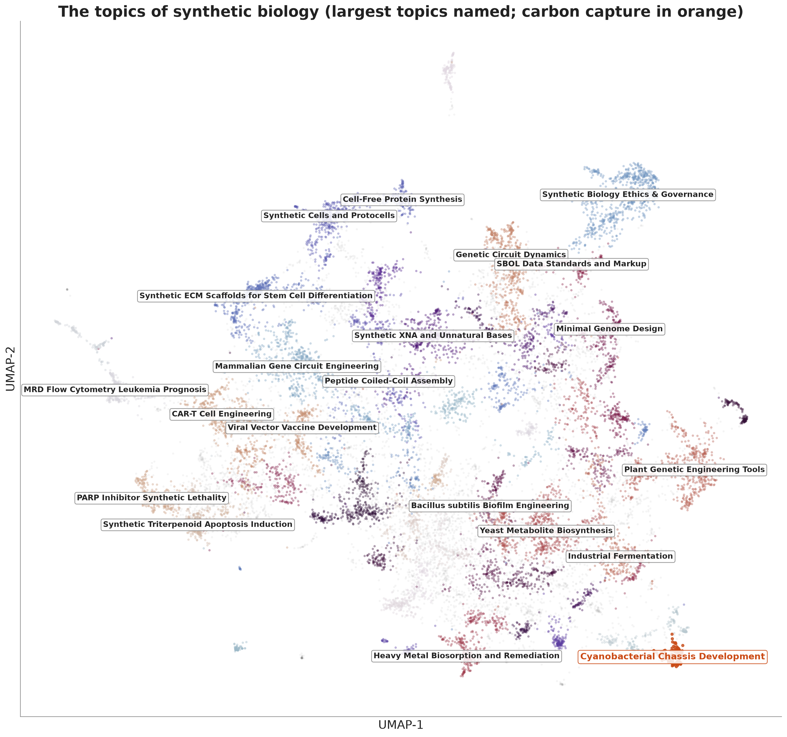

## The question

Biology used to read life. Now it writes it. Synthetic biology engineers organisms, among them microbes that pull carbon back out of the air. The field is young and unevenly spread: a handful of cities do most of the work, and it is hard to watch from outside.

iGEM is a way in. Each year students around the world build synthetic-biology projects, register their DNA parts in an open catalogue, and post a public wiki. It is a rare, geotagged record of people learning the field.

**Do a city's students, academics, and inventors work on the same things?**

::: {.callout-note}
We test semantic relatedness and co-location, not causation.
:::

## Building the corpus

Four kinds of record, one shared schema, every document pinned to a city.

| Source | Records | Geocoded to |
|---|--:|---|
| iGEM registry + wikis | 4,606 projects | team city |
| OpenAlex (keyword) | 10,319 papers | institution city |
| Oldham USPTO set | 2,901 patents | inventor cities (Breschi & Lissoni 2001) |
| iGEM parts registry | ~89,000 BioBricks | team city |

**17,826 documents across the three text types.** Each carries id, type, title, text, year, city, country, and a carbon-capture flag.

## Reading meaning as numbers

- SPECTER2 reads a title and abstract and returns 768 numbers. Work about the same thing lands close together, so relatedness is just cosine distance.
- We fine-tuned it on ~100,000 cross-type links: iGEM wikis citing DOIs, and patent–paper pairs.
- Projects, papers, and patents share one space, so a student wiki and a patent are directly comparable.

The result survives on the plain, un-tuned model too. Fine-tuning sharpens the signal; it does not create it.

## The map of the field

{width="60%" fig-align="center"}

One UMAP of all 17,826 documents, sorted by HDBSCAN into 80 topics (labels drafted by an LLM, checked by hand). Papers cover the whole field; projects and patents each gather in their own corners, and both sit against the papers.

## The measure that fails

::: {.columns}
::: {.column width="55%"}
{width="100%"}
:::
::: {.column width="45%"}
Average a city's projects into one vector, its papers into another, take the cosine.

- Similarity ≈ 0.95 almost everywhere
- But it tracks city size: **r = 0.71**, about half the variance
- It measures how much a city publishes, not what

Keep it as a yardstick and count topics instead.
:::
:::

## The measure that works

Give each city a profile over the 80 topics, scaled to unit length. The overlap of two artifact types is the cosine of their profiles:

`overlap = Σ over topics of (paper share) × (project share)`

Large when the two types weight the same topics, small when they scatter. City size cancels.

One number means nothing on its own, so we test it against a **within-country permutation null**: shuffle which city's papers pair with which city's projects, holding every country's sizes and topic popularity fixed. The *p*-value is the share of shuffles that match or beat the real overlap.

## Papers are the hub

| link | cities | excess | *p* | same-topic lift | beats null? |
|---|:--:|:--:|:--:|:--:|:--:|
| paper × project | 120 | +0.0102 | 0.0065 | 1.30× | ✅ |
| paper × patent | 44 | +0.0347 | 0.0065 | 1.27× | ✅ |
| project × patent | 28 | +0.0043 | 0.227 | 0.99× | ❌ |

A city's papers share topics with both its projects and its patents. The straight project-to-patent link does not survive once country and size are held fixed.

**The science a city publishes is the common ground its students and its inventors both build on.**

## Trying to break it

- **Drop a whole country.** Paper × patent survives losing the US (*p* ≈ 0.001). Paper × project leans on the US and China; without the US it softens to *p* = 0.069. We say so plainly.
- **Change the topic count.** From 10 to 120 clusters, both paper links stay significant; project × patent never does.
- **Starve the sample.** Squeeze a working link down to 28 cities and it often reads as noise. At 28 cities the project–patent leg is simply undetected — too little data to call it either way.
- **Drop the fine-tuning.** The signal holds on base SPECTER2.

## The parts agree

::: {.columns}
::: {.column width="52%"}
{width="100%"}
:::
::: {.column width="48%"}
Is this only an artifact of how the model reads text? Check it against something the model never saw.

- One city-by-city distance from the mix of **BioBrick part classes** (promoter, CDS, terminator, …)
- Compare to the semantic topic distance
- Mantel **r = 0.127**, **p = 0.0005**, 164 cities

Two windows, one of words and one of DNA parts, see the same shape.
:::
:::

## A dynamic trace

::: {.columns}
::: {.column width="55%"}
{width="100%"}
:::
::: {.column width="45%"}
Difference-in-differences within a city and topic, after removing each city's baseline and each topic's global trend.

- **Paper → patent:** β = +0.355, *p* = 0.028 (N = 44). Academic work moves with later patenting in the same topic.
- **Project → paper:** clear in the larger two-type sample, underpowered with all three.

This is co-movement in time, not proof of cause.
:::
:::

## Carbon capture, city by city

Three neighbouring topics trace one ladder:

- **Cyanobacterial metabolic engineering** — where the projects sit
- **Cyanobacterial chassis development** — where the papers sit
- **Industrial fermentation** — where the patents sit

The cities doing all three at once: **Auckland, Uppsala, Daejeon, San Diego, Gainesville.** Inside this one subfield the local alignment is about as strong as it is across the whole field.

## What it shows, and what it can't

**Shows.** Real, size-independent local relatedness between a city's projects and its papers, and its papers and its patents. It holds when we drop countries, change the topic count, and drop the fine-tuning, and the physical parts agree.

**Can't.** Cause. The three grow from the same soil: the same universities, mentors, and funders. We map the pattern; we do not name the mechanism.

**So what.** Where students cluster marks where a field is putting down roots. Funding student science and open tools is consistent with an early bet on where the work will grow.

## Thank you

**Website** — [zer0juice.github.io/synbiomap](https://zer0juice.github.io/synbiomap)

**Code & data** — [github.com/Zer0Juice/synbiomap](https://github.com/Zer0Juice/synbiomap)

**Manuscript & this deck (PDF)** — on the [Paper](paper.qmd) page

Advised by Frank Neffke (CSH) and Claudia Doblinger (TU Munich)

# Backup {visibility="uncounted"}

## Projects and papers in time {visibility="uncounted"}

{width="58%" fig-align="center"}

In the two-type sample the project–paper similarity peaks when papers come about three years after projects. With all three types the profile flattens toward a null, so treat the ordering as suggestive rather than settled.

## The permutation nulls {visibility="uncounted"}

{width="46%" fig-align="center"}

Each grey histogram is the range of overlaps the within-country shuffle produces; the orange line is the real value. The two paper links sit out in the tail; project × patent sits inside the noise.

## Robustness across topic counts {visibility="uncounted"}

{width="70%" fig-align="center"}

From 10 to 120 topics, paper × project and paper × patent stay significant; project × patent never crosses. The result is not an accident of one clustering choice.

## Base vs fine-tuned SPECTER2 {visibility="uncounted"}

- The co-membership result reproduces on base SPECTER2 across the whole topic-count sweep.
- Fine-tuning on cross-type citation links tightens the excess and lowers the *p*-values; it does not manufacture the effect.
- This answers the worry that the signal is an artifact of training the model on the same links we then test.

## A worked thread: Uppsala {visibility="uncounted"}

Uppsala 2009's *Booze Bugs* engineered cyanobacteria to make alcohol from sunlight and registered the parts. A 2014 paper cites the team's own BioBrick. One city, competition to publication, in a single traceable thread.
