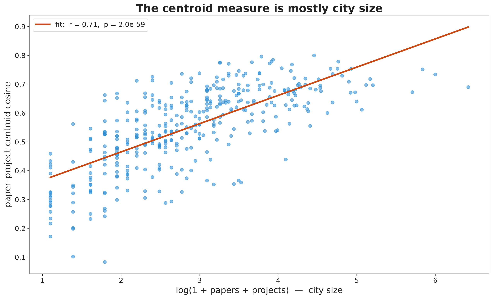
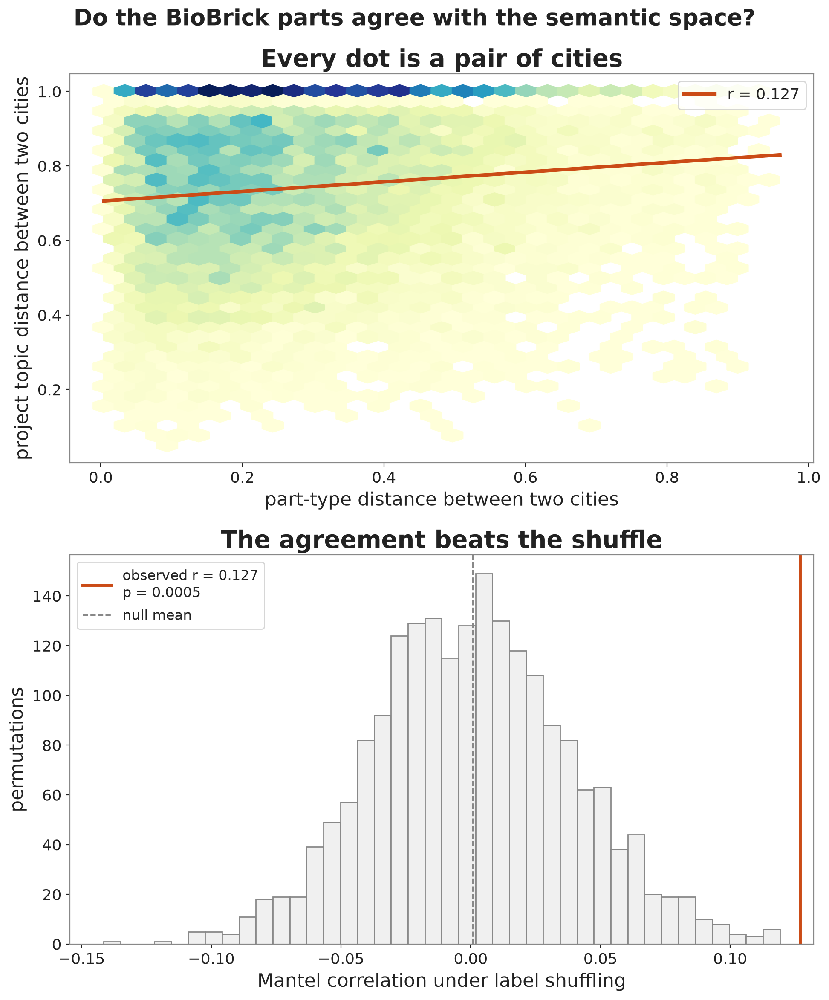
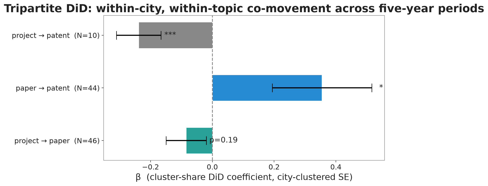
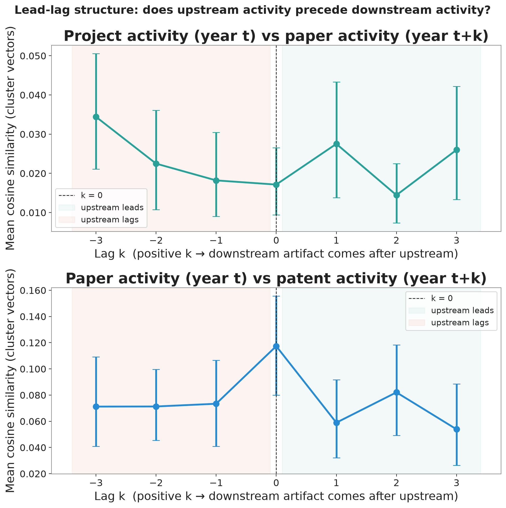
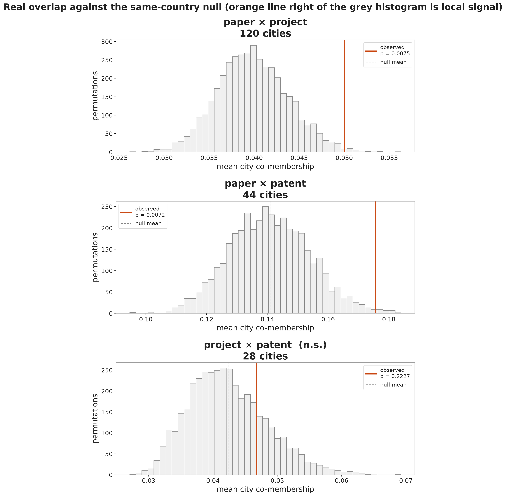
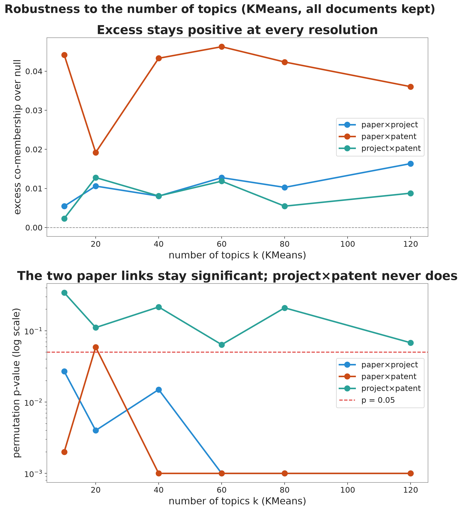

## Motivation

- Climate Crisis
- Biology has become Synthetic
- Engineered cyanobacteria might be the answer
- SynBio is hard to study, certain regions dominate
- iGEM student projects may provide insights

**Do a city's students, academics, and inventors work on the same things?**


## Data

| Source                |           Records |
| --------------------- | ----------------: |
| iGEM registry + wikis |    4,606 projects |
| OpenAlex (keyword)    |     10,319 papers |
| Oldham USPTO set      |     2,901 patents |
| iGEM parts registry   | ~89,000 BioBricks |

**17,826 documents across the three text types**

## Embeddings

- SPECTER2 trained on title and abstract
- Relatedness = cosine distance
- Fine-tuned on ~100,000 cross-type links

## Mapping the Field

::: {.exp-slide-caption}
Every project, paper, and patent in one shared semantic space (left) and on the world map (right). Click a point, a **cluster label**, or a **city** to light the same work up across both views.
:::

```{=html}
<style>
  /* Fit the linked explorer inside a slide and the scrolling deck. */
  #explorer-app { font-size: 0.8rem; }
  #exp-umap, #exp-map { height: min(500px, 50vh) !important; }
  .exp-slide-caption { font-size: 0.6em; color: #586e75; margin: 0 0 0.4em; line-height: 1.35; }
</style>
<script src="https://cdn.plot.ly/plotly-2.27.0.min.js"></script>
<div id="explorer-app"></div>
<script src="assets/js/explorer.js"></script>
<script>
/* Plotly draws at 0x0 inside a hidden reveal slide. Re-fit the two panels
   whenever this slide scrolls or flips into view (present mode + scroll view). */
(function () {
  function bump() {
    ["exp-umap", "exp-map"].forEach(function (id) {
      var d = document.getElementById(id);
      if (d && window.Plotly && d.data) Plotly.Plots.resize(d);
    });
    window.dispatchEvent(new Event("resize"));
  }
  var app = document.getElementById("explorer-app");
  if (app && "IntersectionObserver" in window) {
    new IntersectionObserver(function (es) {
      es.forEach(function (e) { if (e.isIntersecting) setTimeout(bump, 80); });
    }, { threshold: 0.05 }).observe(app);
  }
}());
</script>
```

## Average Relatedness

::: {.columns}
::: {.column width="55%"}
{width="100%"}
:::
::: {.column width="45%"}
Averaging a city's projects into one vector, its papers into another, and taking cosine distance between the two vectors

- tracks city size: **r = 0.71**, about half the variance
- It measures how much a city publishes, not what

We need a finer grained look

:::
:::

## Topic Clustering

Give each city a profile over the 80 topics, scaled to unit length. The overlap of two artifact types is the cosine of their profiles:

`overlap = Σ over topics of (paper share) × (project share)`

Large when the two types weight the same topics, small when they scatter. City size cancels.

One number means nothing on its own, so we test it against a **within-country permutation null**: shuffle which city's papers pair with which city's projects, holding every country's sizes and topic popularity fixed. The *p*-value is the share of shuffles that match or beat the real overlap.

## Papers are the hub

| link | cities | excess | *p* | same-topic lift | beats null? |
|---|:--:|:--:|:--:|:--:|:--:|
| paper × project | 120 | +0.0102 | 0.0065 | 1.30× | Y |
| paper × patent | 44 | +0.0347 | 0.0065 | 1.27× | Y |
| project × patent | 28 | +0.0043 | 0.227 | 0.99× | N |

A city's papers share topics with both its projects and its patents. The straight project-to-patent link does not survive once country and size are held fixed.

**The science a city publishes is the common ground its students and its inventors both build on.**

## Robustness Checks

- **Drop a whole country.** Paper × patent survives losing the US (*p* ≈ 0.001). Paper × project leans on the US and China; without the US it softens to *p* = 0.069
- **Change the topic count.** From 10 to 120 clusters, both paper links stay significant; project × patent never does.
- **Starve the sample.** Squeeze a working link down to 28 cities and it often reads as noise. At 28 cities the project–patent leg is simply undetected — too little data to call it either way.
- **Drop the fine-tuning.** The signal holds on base SPECTER2.

## BioBrick Space Robustness Check

::: {.columns}
::: {.column width="52%"}
{width="100%"}
:::
::: {.column width="48%"}
Is this only an artifact of how the model reads text? Check it against something the model never saw.

- One city-by-city distance from the mix of **BioBrick part classes** (promoter, CDS, terminator, …)
- Compare to the semantic topic distance
- Mantel **r = 0.127**, **p = 0.0005**, 164 cities

Two windows, one of words and one of DNA parts, see the same shape.
:::
:::

## A dynamic trace

::: {.columns}
::: {.column width="55%"}
{width="100%"}
:::
::: {.column width="45%"}
Difference-in-differences within a city and topic, after removing each city's baseline and each topic's global trend.

- **Paper → patent:** β = +0.355, *p* = 0.028 (N = 44). Academic work moves with later patenting in the same topic.
- **Project → paper:** clear in the larger two-type sample, underpowered with all three.

This is co-movement in time, not proof of cause.
:::
:::

## Carbon capture, city by city

Three neighbouring topics trace one ladder:

- **Cyanobacterial metabolic engineering** — where the projects sit
- **Cyanobacterial chassis development** — where the papers sit
- **Industrial fermentation** — where the patents sit

The cities doing all three at once: **Auckland, Uppsala, Daejeon, San Diego, Gainesville.** Inside this one subfield the local alignment is about as strong as it is across the whole field.

## What it shows, and what it can't

**Shows.** Real, size-independent local relatedness between a city's projects and its papers, and its papers and its patents. It holds when we drop countries, change the topic count, and drop the fine-tuning, and the physical parts agree.

**Can't.** Cause. The three grow from the same soil: the same universities, mentors, and funders. We map the pattern; we do not name the mechanism.

**So what.** Where students cluster marks where a field is putting down roots. Funding student science and open tools is consistent with an early bet on where the work will grow.

## Thank you

**Website** — [zer0juice.github.io/synbiomap](https://zer0juice.github.io/synbiomap)

**Code & data** — [github.com/Zer0Juice/synbiomap](https://github.com/Zer0Juice/synbiomap)

**Manuscript & this deck (PDF)** — on the [Paper](paper.qmd) page

Advised by Frank Neffke (CSH) and Claudia Doblinger (TU Munich)

# Backup {visibility="uncounted"}

## Projects and papers in time {visibility="uncounted"}

{width="58%" fig-align="center"}

In the two-type sample the project–paper similarity peaks when papers come about three years after projects. With all three types the profile flattens toward a null, so treat the ordering as suggestive rather than settled.

## The permutation nulls {visibility="uncounted"}

{width="46%" fig-align="center"}

Each grey histogram is the range of overlaps the within-country shuffle produces; the orange line is the real value. The two paper links sit out in the tail; project × patent sits inside the noise.

## Robustness across topic counts {visibility="uncounted"}

{width="70%" fig-align="center"}

From 10 to 120 topics, paper × project and paper × patent stay significant; project × patent never crosses. The result is not an accident of one clustering choice.

## Base vs fine-tuned SPECTER2 {visibility="uncounted"}

- The co-membership result reproduces on base SPECTER2 across the whole topic-count sweep.
- Fine-tuning on cross-type citation links tightens the excess and lowers the *p*-values; it does not manufacture the effect.
- This answers the worry that the signal is an artifact of training the model on the same links we then test.

## A worked thread: Uppsala {visibility="uncounted"}

Uppsala 2009's *Booze Bugs* engineered cyanobacteria to make alcohol from sunlight and registered the parts. A 2014 paper cites the team's own BioBrick. One city, competition to publication, in a single traceable thread.
