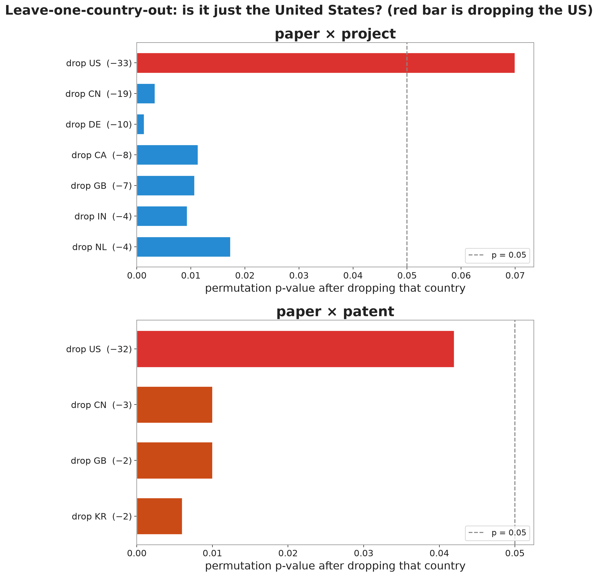

## Motivation

- Climate Crisis
- Biology has become Synthetic
- Engineered cyanobacteria might be the answer
- SynBio is hard to study, certain regions dominate
- iGEM student projects may provide insights

**Do a city's students, academics, and inventors work on the same things?**


## Data

| Source                |          Records |
| --------------------- | ---------------: |
| iGEM registry + wikis |   4,606 projects |
| OpenAlex (keyword)    |    10,319 papers |
| Oldham USPTO set      |    2,901 patents |
| iGEM parts registry   | 89,060 BioBricks |

**17,826 artifacts to be textually compared**

## Language Embeddings

- NLP Models represent text through vectors
- SPECTER2 trained on title and abstract
- Relatedness = cosine distance between vectors
- Fine-tuned for this project on ~100,000 cross-type links

## Mapping the Field


```{=html}
<style>
  /* Fit the linked explorer inside a slide and the scrolling deck. */
  #explorer-app { font-size: 1rem; }
  #exp-umap, #exp-map { height: min(500px, 50vh) !important; }
  .exp-slide-caption { font-size: 0.6em; color: #586e75; margin: 0 0 0.4em; line-height: 1.35; }
</style>
<script src="https://cdn.plot.ly/plotly-2.27.0.min.js"></script>
<div id="explorer-app"></div>
<script src="assets/js/explorer.js"></script>
<script>
/* Plotly draws at 0x0 inside a hidden reveal slide. Re-fit the two panels
   whenever this slide scrolls or flips into view (present mode + scroll view). */
(function () {
  function bump() {
    ["exp-umap", "exp-map"].forEach(function (id) {
      var d = document.getElementById(id);
      if (d && window.Plotly && d.data) Plotly.Plots.resize(d);
    });
    window.dispatchEvent(new Event("resize"));
  }
  var app = document.getElementById("explorer-app");
  if (app && "IntersectionObserver" in window) {
    new IntersectionObserver(function (es) {
      es.forEach(function (e) { if (e.isIntersecting) setTimeout(bump, 80); });
    }, { threshold: 0.05 }).observe(app);
  }
}());
</script>
```

## Calculating Relatedness

::: {.columns}
::: {.column width="42%"}
Averaging a city's projects into one vector, its papers into another, and taking cosine distance between the two vectors

**90% of projects are semantically closer to their own city’s average paper than to a random city**
:::

::: {.column width="58%"}
```{=html}
<div id="alignment-app"></div>
<script src="assets/js/alignment.js"></script>
```
:::
:::

## The Problem with Averaging Vectors

::: {.columns}
::: {.column width="50%"}
::: {style="font-size:0.72em"}

|               | Relatedness Regressed on Number of Artifacts |
| ------------- | :------------------------------------------: |
| log(papers)   |                 0.0164\*\*\*                 |
|               |                   (0.0015)                   |
| log(projects) |                 0.0190\*\*\*                 |
|               |                   (0.0018)                   |
| *N* cities    |                     387                      |
| *R²*          |                   **0.63**                   |


:::

- Size alone explains **63%** of relatedness
- Confounded by city size, need something more fine-grained

:::

::: {.column width="50%"}
```{=html}
<div id="centroid-app"></div>
<script src="assets/js/centroid.js"></script>
```
:::
:::

## Topic Profiling

::: {.columns}
::: {.column width="40%"}
Give each city a profile over the 80 topics, scaled to unit length. The overlap of two artifact types is the cosine of their profiles:

`overlap = Σ over topics of (paper share) × (project share)`

Large when the two types weight the same topics, small when they scatter
:::

::: {.column width="60%"}
```{=html}
<div id="topic-profile-app"></div>
<script src="assets/js/topic_profile.js"></script>
```
:::
:::

## Papers Link Patents and Projects

| link | cities | excess | *p* | same-topic lift | beats null? |
|---|:--:|:--:|:--:|:--:|:--:|
| paper × project | 120 | +0.0102 | 0.0065 | 1.30× | Y |
| paper × patent | 44 | +0.0347 | 0.0065 | 1.27× | Y |
| project × patent | 28 | +0.0043 | 0.227 | 0.99× | N |

A city's papers share topics with its projects and patents. The project-to-patent link is not significant when country and size are held fixed fixed.

**The science a city publishes is the common ground between student and Commercial Research**

## Projects enter clusters their city knows

::: {.columns}
::: {.column width="54%"}
::: {style="font-size:0.72em"}
`in_known = 1[city c has a paper in cluster k before year y]`

| | value |
|---|:--:|
| projects tested | 2,742 |
| own-city entry rate | **7.8%** |
| baseline (random city) | 1.4% |
| mean δ (own − baseline) | +0.063 |
| *t*-test (H₀: δ = 0) | *t* = 12.6 |
| *p*-value | < 0.001 |
:::
:::
::: {.column width="46%"}
For each non-noise project in cluster *k*, city *c*, year *y*, ask whether the city had already published in that cluster. An iGEM Project is

[≈ 5.5×]{style="display:block;text-align:center;font-size:2.9em;font-weight:800;color:#268bd2;line-height:1.05;margin:0.15em 0 0;"}
more likely to enter a cluster its city already publishes in

:::
:::

## Robustness Checks

- **Dropping large countries.** Paper × patent survives losing the US (*p* ≈ 0.04, still below 0.05). Paper × project leans on the US; without it the link softens to *p* ≈ 0.07
- **Changing number of clusters.** From 10 to 120 clusters, paper x patent and paper x project stay significant. project × patent never does.
- **Dropping fine-tuning.** The signal holds on base SPECTER2.
- **Comparison with BioBrick Relatedness**. Cities that specialize in the same research areas use similar tools. Cities close together in cluster co-occurence space are close in the biobrick co-occurence space

## Which reaches a city's topic first?

::: {.columns}
::: {.column width="52%"}
::: {style="font-size:0.8em"}
Head-to-head within the 2009–2018 overlap window, counting only city-topics where **both** types appear:

| in the same city-topic | who's first |
|---|:--|
| project vs paper | **project — 76%** · *p* < 0.001 |
| project vs patent | project — 75% · *n* = 16 (ns) |
| paper vs patent | roughly tied |
:::
:::
::: {.column width="48%"}
[76%]{style="display:block;text-align:center;font-size:3em;font-weight:800;color:#268bd2;line-height:1;margin:0.1em 0 0;"}
[of the time a city enters a cluster with an iGEM project before a paper]{style="display:block;text-align:center;color:#586e75;font-size:0.9em;margin-bottom:0.5em;"}

:::
:::
## What this shows

**Real, size-independent local relatedness exists between a city's iGEM projects and its papers, and its papers and its patents**

**So what?** Funding student science and open tools helps. iGEM projects can be used as a useful indicator of where a city's research might be moving next

## Thank you!

**Website** — [zer0juice.github.io/synbiomap](https://zer0juice.github.io/synbiomap)

**Code & data** — [github.com/Zer0Juice/synbiomap](https://github.com/Zer0Juice/synbiomap)

**Manuscript & this deck (PDF)** — on the [Paper](paper.qmd) page

Advised by Frank Neffke (CSH) and Claudia Doblinger (TU Munich)

# Backup {visibility="uncounted"}

## How do cities specialize over time? {visibility="uncounted"}

::: {.columns}
::: {.column width="55%"}
{width="100%"}
:::
::: {.column width="45%"}
Difference-in-differences within a city and topic, after removing each city's baseline and each topic's global trend.

- **Paper → patent:** β = +0.355, *p* = 0.028 (N = 44). Academic work moves with later patenting in the same topic.
- **Project → paper:** clear in the larger two-type sample, underpowered with all three.

This is co-movement in time, not proof of cause.
:::
:::


## Projects and papers in time {visibility="uncounted"}

{width="58%" fig-align="center"}

In the two-type sample the project–paper similarity peaks when papers come about three years after projects. With all three types the profile flattens toward a null, so treat the ordering as suggestive rather than settled.

## The permutation nulls {visibility="uncounted"}

{width="46%" fig-align="center"}

Each grey histogram is the range of overlaps the within-country shuffle produces; the orange line is the real value. The two paper links sit out in the tail; project × patent sits inside the noise.

## Dropping a whole country {visibility="uncounted"}

::: {.columns}
::: {.column width="50%"}
{width="100%"}
:::
::: {.column width="50%"}
Re-run the within-country permutation test after removing each large country in turn. Each bar is the link's *p*-value once that country is gone; the dashed line is *p* = 0.05.

- **Paper × patent** stays below 0.05 for every drop, including the US (≈0.04) — it leans on no single country.
- **Paper × project** clears 0.05 in every case but one: drop the US and it softens to ≈0.07. We flag this openly.

The red bar is dropping the US.
:::
:::

## Robustness across topic counts {visibility="uncounted"}

{width="70%" fig-align="center"}

From 10 to 120 topics, paper × project and paper × patent stay significant; project × patent never crosses. The result is not an accident of one clustering choice.

## Base vs fine-tuned SPECTER2 {visibility="uncounted"}

- The co-membership result reproduces on base SPECTER2 across the whole topic-count sweep.
- Fine-tuning on cross-type citation links tightens the excess and lowers the *p*-values; it does not manufacture the effect.
- This answers the worry that the signal is an artifact of training the model on the same links we then test.

## Is this reflected by the BioBricks? {visibility="uncounted"}

::: {.columns}
::: {.column width="52%"}
{width="100%"}
:::
::: {.column width="48%"}
Is this only an artifact of how the model reads text? Check it against something the model never saw.

- One city-by-city distance from the mix of **BioBrick part classes** (promoter, CDS, terminator, …)
- Compare to the semantic topic distance
- Mantel **r = 0.127**, **p = 0.0005**, 164 cities

Two windows, one of words and one of DNA parts, see the same shape.
:::
:::
## A worked thread: Uppsala {visibility="uncounted"}

Uppsala 2009's *Booze Bugs* engineered cyanobacteria to make alcohol from sunlight and registered the parts. A 2014 paper cites the team's own BioBrick. One city, competition to publication, in a single traceable thread.
